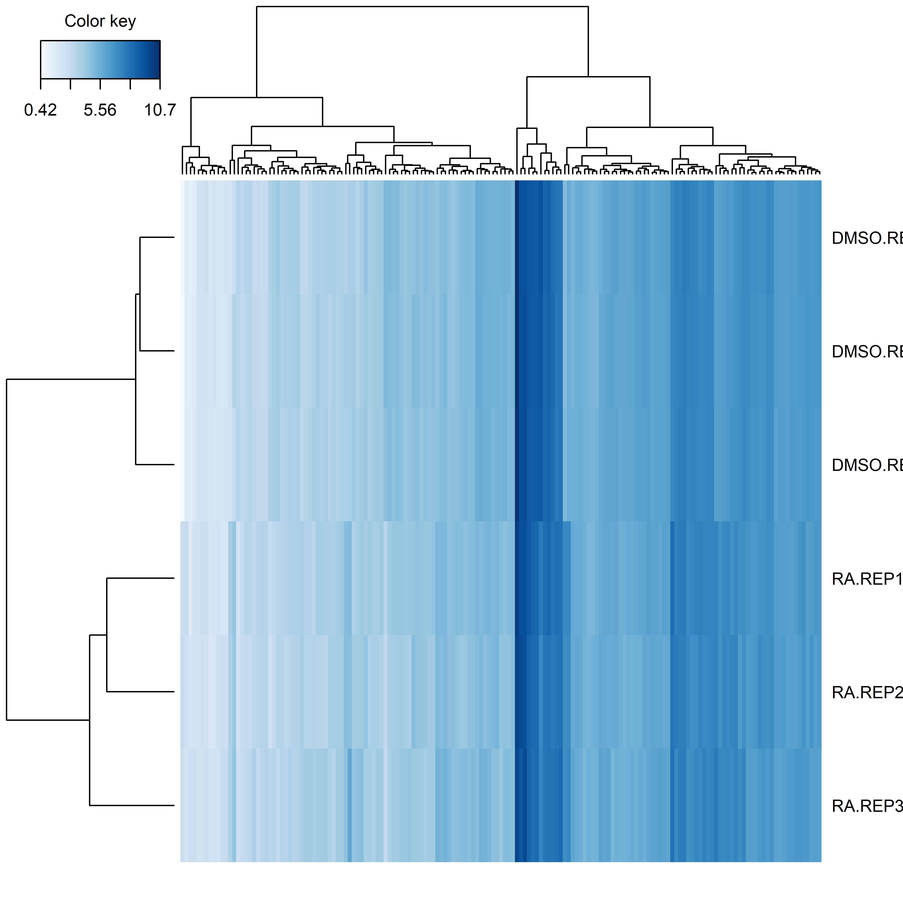

## OHSU Interview Follow Up - Data Analysis
### **Audrey Gill**

```{r setup, include=FALSE}
knitr::opts_chunk$set(warning = F)
knitr::opts_chunk$set(message = F)
knitr::opts_chunk$set(error = F)
setwd("C:/Users/effyg/Desktop/CEDAR_interview/")
library(tidyverse)
library(edgeR)
library(HTSFilter)
library(mixOmics)
library(RColorBrewer)
set.seed(125)
```


### Quality assessment and normalization

``` {r data check}
musRNA <- read.table("RA_vs_DMSO_counts.txt", row.names=1, sep="\t", header=T, stringsAsFactors = F)
longsamples <- colnames(musRNA)[grep("^mESc", colnames(musRNA))]
colnames(musRNA) <- gsub("mESc.2i.RNA.","", colnames(musRNA))
condition <- gsub("mESc.2i.RNA.","",longsamples) %>% gsub("\\..*", "",.)

musDGE <- DGEList(musRNA[,grepl("^DM|^RA", colnames(musRNA))], group=condition)
plotdat <- gather(as.data.frame(musDGE$counts), key=Sample, value = Counts)
plotdat$log2counts <- log2(plotdat$Counts + 1)
ggplot(data=plotdat) +
  geom_boxplot(aes(y=log2counts, color=Sample, x=Sample)) +
  theme(legend.position = "none") 
plotMDS(musDGE)
```

The count distribution of one of the RA replicates (RA.REP2) differs from all other count distributions. The samples need to be normalized. 

First, remove all genes with 0 counts across samples. This reduces the total number of genes from `r dim(musRNA)[1]` to `r dim(musRNA[rowSums(musDGE$counts)!=0,])[1]`. Next, normalize the counts using TMM and a $log_2(cpm+1)$ transformation. 


``` {r DGE}
# Remove genes with 0 counts across all samples
musDGE <- DGEList(musDGE$counts[apply(musDGE$counts, 1, sum) != 0, ], group=musDGE$samples$group)
# Add normalization factor to DGEList
musDGE <- calcNormFactors(musDGE, method="TMM")
#Create new plot data and plot
normCPM <- log2(cpm(musDGE)+1)
plotnewcounts <-as.data.frame(normCPM) %>% gather(., key=Sample, value = Counts)
ggplot(data=plotnewcounts) +
  geom_boxplot(aes(y=Counts, color=Sample, x=Sample)) +
  theme(legend.position = "none")
plotMDS(normCPM)
```

Based on the above plots, normalization is successful.

### Examine expression difference between RA and DMSO

First calculate dispersion measures to estimate significance and degree of regulation. Then filter results based on the global Jaccard index, which identifies genes with low levels of expression across experimental groups.
 
``` {r filter}
musDGE <- estimateCommonDisp(musDGE)
musDGE <- estimateTagwiseDisp(musDGE)
musTest <- exactTest(musDGE)
# Filter low count genes
musFilt <- HTSFilter(musDGE)
musFiltTest <- exactTest(musFilt$filteredData)
```

Now up and down regulated genes can be identified and stored for future use. Here an FDR filter of 0.01 is used on the filtered data.
``` {r test, fig.width=12}
# Add FDR
musFiltTop <- topTags(musFiltTest, n=nrow(musFiltTest$table))
musFDRPass <- musFiltTop$table[musFiltTop$table$FDR<0.01,]
plotSmear(musFiltTest, de.tags = rownames(musFDRPass))

# Create up and down regulated files
musDownReg <- musFDRPass[order(musFDRPass$logFC),]
musUpReg <- musFDRPass[order(musFDRPass$logFC, decreasing = T),]
```

Here `r dim(musFDRPass)[1]` genes have been analyzed. These are saved in their respective ordered files.

``` {r save csv, eval=F}
write.csv(musDownReg, "Down_Regulated_Mus_genes.csv")
write.csv(musUpReg, "Up_Regulated_Mus_genes.csv")
```

Finally, a clustered image map is used to find broad trends in the filtered genes that pass an additional filter of $|logFC| > 2$.

``` {r heatmap}
# Add heatmap with dendro
musHMDat <- t(normCPM[rownames(musFiltTest$table)[abs(musFiltTop$table$logFC) > 2],]) 
musColor <- colorRampPalette(rev(brewer.pal(9, "Blues")))(255)[255:1]

# For some reason this won't knit, but the image can still be generated.
#musHM <- cim(musHMDat, color=musColor, symkey=F, col.names=F, margins = c(2,4), save = "png")
```

The below plot shows a slight difference between experimental groups, and there appears to be some clustering between what appear to be up and down regulated gene clusters.



